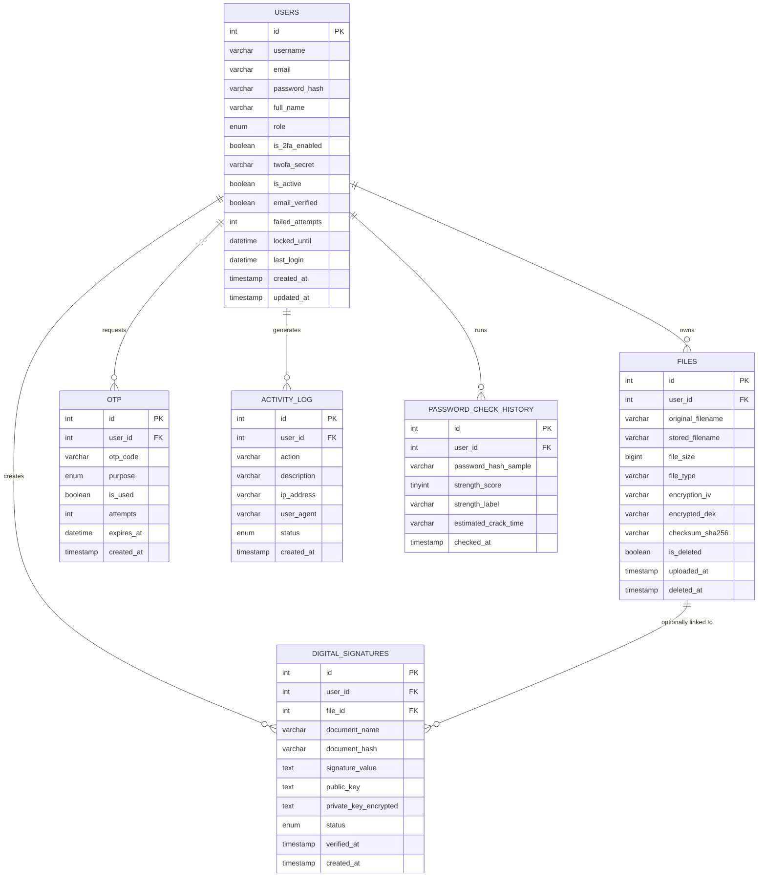

# CyberShield — DBMS Schema Documentation

**Database:** `cybershield_db` (MySQL 8.0+, InnoDB engine, `utf8mb4`)
**Source of truth:** [`database.sql`](../database.sql) — run it directly with
`mysql -u root -p < database.sql` to create everything below.

---

## 1. Entity-Relationship Diagram (Mermaid)



## 2. Table-by-Table Reference

### 2.1 `Users`
Holds authentication credentials and 2FA state.

| Column | Type | Constraints | Notes |
|---|---|---|---|
| id | INT | PK, AUTO_INCREMENT | |
| username | VARCHAR(50) | UNIQUE, NOT NULL | |
| email | VARCHAR(120) | UNIQUE, NOT NULL | |
| password_hash | VARCHAR(255) | NOT NULL | bcrypt hash — plaintext never stored |
| full_name | VARCHAR(100) | | |
| role | ENUM('user','admin') | DEFAULT 'user' | |
| is_2fa_enabled | BOOLEAN | DEFAULT FALSE | Google Authenticator (TOTP) enabled |
| twofa_secret | VARCHAR(64) | NULL | base32 TOTP secret (pyotp) for Google Authenticator |
| is_active | BOOLEAN | DEFAULT TRUE | admin can disable an account |
| email_verified | BOOLEAN | DEFAULT FALSE | email verification status |
| failed_attempts | INT | DEFAULT 0 | brute-force lockout counter |
| locked_until | DATETIME | NULL | temporary lockout expiry |
| last_login | DATETIME | NULL | |
| created_at / updated_at | TIMESTAMP | auto | |

**Indexes:** `idx_users_email`, `idx_users_username`

### 2.2 `Files`
Metadata for AES-256-GCM encrypted uploads. Ciphertext itself lives on disk
under `/encrypted`, never in the database.

| Column | Type | Constraints | Notes |
|---|---|---|---|
| id | INT | PK, AUTO_INCREMENT | |
| user_id | INT | FK → Users.id, ON DELETE CASCADE | owner |
| original_filename | VARCHAR(255) | NOT NULL | user-facing name |
| stored_filename | VARCHAR(255) | UNIQUE, NOT NULL | UUID-based name on disk |
| file_size | BIGINT | NOT NULL | plaintext size in bytes |
| file_type | VARCHAR(50) | NOT NULL | extension |
| encryption_iv | VARCHAR(64) | NOT NULL | base64 AES-GCM nonce for the file itself |
| encrypted_dek | VARCHAR(255) | NOT NULL | per-file key, wrapped by the master key |
| checksum_sha256 | VARCHAR(64) | NOT NULL | plaintext integrity hash |
| is_deleted | BOOLEAN | DEFAULT FALSE | soft delete |
| uploaded_at / deleted_at | TIMESTAMP | | |

**Indexes:** `idx_files_user`, `idx_files_deleted`

### 2.3 `Digital_Signatures`
Record of every RSA-2048 signing/verification event.

| Column | Type | Constraints | Notes |
|---|---|---|---|
| id | INT | PK, AUTO_INCREMENT | |
| user_id | INT | FK → Users.id, CASCADE | |
| file_id | INT | FK → Files.id, SET NULL | optional link to a stored file |
| document_name | VARCHAR(255) | NOT NULL | |
| document_hash | VARCHAR(128) | NOT NULL | SHA-256 hex digest |
| signature_value | TEXT | NOT NULL | base64 RSA-PSS signature |
| public_key | TEXT | NOT NULL | PEM public key |
| private_key_encrypted | TEXT | NULL | PEM private key (see security notes in README) |
| status | ENUM('signed','verified','failed','tampered') | DEFAULT 'signed' | |
| verified_at | TIMESTAMP | NULL | |
| created_at | TIMESTAMP | auto | |

**Indexes:** `idx_signatures_user`, `idx_signatures_hash`

### 2.4 `OTP`
One-time codes for login 2FA / password-reset flows.

| Column | Type | Constraints | Notes |
|---|---|---|---|
| id | INT | PK, AUTO_INCREMENT | |
| user_id | INT | FK → Users.id, CASCADE | |
| otp_code | VARCHAR(10) | NOT NULL | 6-digit numeric |
| purpose | ENUM('login','enable_2fa','reset_password') | DEFAULT 'login' | |
| is_used | BOOLEAN | DEFAULT FALSE | single-use enforcement |
| attempts | INT | DEFAULT 0 | failed-verification counter |
| expires_at | DATETIME | NOT NULL | |
| created_at | TIMESTAMP | auto | |

**Indexes:** `idx_otp_user`, `idx_otp_expiry`

### 2.5 `Activity_Log`
Security audit trail — every login, upload, signature and admin action.

| Column | Type | Constraints | Notes |
|---|---|---|---|
| id | INT | PK, AUTO_INCREMENT | |
| user_id | INT | FK → Users.id, SET NULL | nullable for anonymous/failed attempts |
| action | VARCHAR(100) | NOT NULL | e.g. `LOGIN_SUCCESS`, `FILE_UPLOAD` |
| description | VARCHAR(255) | NULL | |
| ip_address | VARCHAR(45) | NULL | IPv4/IPv6 |
| user_agent | VARCHAR(255) | NULL | |
| status | ENUM('success','failure','warning') | DEFAULT 'success' | |
| created_at | TIMESTAMP | auto | |

**Indexes:** `idx_activity_user`, `idx_activity_action`, `idx_activity_created`

### 2.6 `Password_Check_History`
History of strength checks. **Never stores plaintext** — only a SHA-256
sample and computed metrics.

| Column | Type | Constraints | Notes |
|---|---|---|---|
| id | INT | PK, AUTO_INCREMENT | |
| user_id | INT | FK → Users.id, SET NULL | nullable for anonymous checks |
| password_hash_sample | VARCHAR(255) | NOT NULL | SHA-256 of the checked password |
| strength_score | TINYINT | NOT NULL | 0–100 |
| strength_label | VARCHAR(20) | NOT NULL | Weak / Fair / Good / Strong / Very Strong |
| estimated_crack_time | VARCHAR(50) | NULL | human-readable |
| checked_at | TIMESTAMP | auto | |

**Indexes:** `idx_pwd_history_user`

## 3. Relationship Summary

| Parent | Child | Cardinality | On Delete |
|---|---|---|---|
| Users | Files | 1 : N | CASCADE |
| Users | Digital_Signatures | 1 : N | CASCADE |
| Users | OTP | 1 : N | CASCADE |
| Users | Activity_Log | 1 : N | SET NULL |
| Users | Password_Check_History | 1 : N | SET NULL |
| Files | Digital_Signatures | 1 : N (optional) | SET NULL |

## 4. Normalization Notes
The schema is in **3NF**: every non-key attribute depends only on its table's
primary key (no partial or transitive dependencies), and repeating groups
(e.g. multiple OTPs, multiple files per user) are correctly split into their
own child tables rather than stored as repeating columns.

## 5. Sample Queries

```sql
-- All active files for a user
SELECT original_filename, file_size, uploaded_at
FROM Files
WHERE user_id = 1 AND is_deleted = FALSE
ORDER BY uploaded_at DESC;

-- Recent failed logins (security monitoring)
SELECT u.username, a.ip_address, a.created_at
FROM Activity_Log a
LEFT JOIN Users u ON u.id = a.user_id
WHERE a.action = 'LOGIN_FAILED'
ORDER BY a.created_at DESC
LIMIT 20;

-- Users who have NOT enabled 2FA (candidates for a security reminder email)
SELECT username, email FROM Users 
WHERE is_2fa_enabled = FALSE AND is_active = TRUE AND email_verified = TRUE;

-- Users with unverified emails
SELECT username, email, created_at 
FROM Users 
WHERE email_verified = FALSE
ORDER BY created_at DESC;

-- Dashboard statistics for a user
SELECT 
    (SELECT COUNT(*) FROM Files WHERE user_id = 1 AND is_deleted = FALSE) AS file_count,
    (SELECT COUNT(*) FROM Digital_Signatures WHERE user_id = 1) AS signature_count,
    (SELECT COUNT(*) FROM Activity_Log WHERE user_id = 1 AND action = 'PASSWORD_CHECK') AS password_check_count,
    (SELECT is_2fa_enabled FROM Users WHERE id = 1) AS twofa_status;

-- Average password strength score across all checks
SELECT ROUND(AVG(strength_score), 1) AS avg_score FROM Password_Check_History;

-- Most active users (by activity log entries)
SELECT u.username, u.email, COUNT(a.id) AS activity_count
FROM Users u
LEFT JOIN Activity_Log a ON a.user_id = u.id
GROUP BY u.id
ORDER BY activity_count DESC
LIMIT 10;

-- Recent password checks with strength distribution
SELECT 
    strength_label,
    COUNT(*) AS count,
    ROUND(AVG(strength_score), 1) AS avg_score
FROM Password_Check_History
WHERE checked_at >= DATE_SUB(NOW(), INTERVAL 30 DAY)
GROUP BY strength_label
ORDER BY avg_score DESC;
```

## 6. Recent Implementation Changes

### 6.1 Email Verification System
- **Added Field**: `email_verified` (BOOLEAN, DEFAULT FALSE)
- **Purpose**: Users must verify email before account is fully activated
- **Flow**: 
  1. Registration → Email with OTP sent
  2. User enters OTP on verification page
  3. Account created with `email_verified = TRUE`

### 6.2 Google Authenticator (TOTP) Integration
- **Updated**: `twofa_secret` field now stores base32 secret for Google Authenticator
- **No Email OTP**: Login 2FA uses TOTP codes from Google Authenticator app
- **QR Code**: Generated during 2FA setup for easy scanning
- **Purpose**: `OTP.purpose = 'login'` now primarily for email verification

### 6.3 Enhanced Password Checker
- **Improved Algorithm**: More realistic crack time estimation
- **Considers**:
  - Dictionary words (1000x penalty)
  - Keyboard patterns (100x penalty)  
  - Sequential characters (50x penalty)
  - Repeated characters (10x penalty)
- **New Metrics**: Returns online/offline attack times and entropy bits

### 6.4 Dashboard Real-Time Stats
- **New Tracking**: Password check count added to activity log
- **Action Type**: `PASSWORD_CHECK` logged when user checks password strength
- **Dashboard Display**: Shows count of password strength analyses

### 6.5 Session Management
- **Client-Side**: localStorage tracking for cross-tab logout detection
- **No DB Changes**: Session sync handled purely client-side via browser storage events
- **Security**: All tabs logout automatically when one tab logs out

## 7. Security Enhancements

### 7.1 Authentication Flow
```
Registration:
  Username/Password → Email Verification → Account Created

Login (No 2FA):
  Username/Password → Success

Login (With 2FA):
  Username/Password → Google Authenticator Code → Success
```

### 7.2 Lockout Mechanism
- **Threshold**: 5 failed attempts
- **Duration**: 15 minutes lockout
- **Reset**: Counter resets on successful login
- **Field**: `failed_attempts` increments, `locked_until` sets expiry

### 7.3 Activity Logging
All security-relevant actions logged:
- `LOGIN_SUCCESS` / `LOGIN_FAILED`
- `LOGIN_2FA_SUCCESS` / `LOGIN_2FA_FAILED`
- `LOGOUT`
- `REGISTER`
- `2FA_ENABLED` / `2FA_DISABLED`
- `PASSWORD_CHECK`
- `FILE_UPLOAD` / `FILE_DOWNLOAD` / `FILE_DELETE`
- `SIGNATURE_CREATE` / `SIGNATURE_VERIFY`

## 8. Data Retention & Privacy

### 8.1 What's Stored
- ✅ Bcrypt password hashes (irreversible)
- ✅ SHA-256 file checksums
- ✅ SHA-256 password samples (for history, not auth)
- ✅ Encrypted file DEKs (wrapped by master key)
- ✅ Activity logs with timestamps

### 8.2 What's NOT Stored
- ❌ Plaintext passwords (never)
- ❌ Plaintext files (always encrypted)
- ❌ Credit card or payment info
- ❌ Social security numbers
- ❌ Biometric data

### 8.3 Soft Deletes
- Files use `is_deleted` flag instead of hard delete
- Preserves audit trail
- Actual file deletion can be scheduled separately
- Database cascades on user deletion

## 9. Performance Considerations

### 9.1 Indexes
All foreign keys indexed for join performance:
- `idx_files_user` (user_id)
- `idx_signatures_user` (user_id)
- `idx_activity_user` (user_id)
- `idx_otp_user` (user_id)
- `idx_pwd_history_user` (user_id)

### 9.2 Query Optimization
- Activity log queries limited to recent entries
- Dashboard stats use indexed columns
- Compound indexes on frequently joined columns

### 9.3 Storage Optimization
- Files stored on disk, not in DB (BLOB avoidance)
- TEXT fields only where necessary (signatures, keys)
- VARCHAR lengths appropriately sized

## 10. Backup & Recovery

### 10.1 Critical Data
**Must backup together**:
1. MySQL database (`cybershield_db`)
2. Encrypted files directory (`/encrypted`)
3. Encryption key files (`/keys`)
4. Master encryption key (KEK)

**Without all 4**: Data recovery impossible

### 10.2 Backup Strategy
```bash
# Database backup
mysqldump -u root -p cybershield_db > backup_$(date +%Y%m%d).sql

# File system backup
tar -czf files_backup_$(date +%Y%m%d).tar.gz encrypted/ keys/
```

### 10.3 Restore Procedure
```bash
# Restore database
mysql -u root -p cybershield_db < backup_20260105.sql

# Restore files
tar -xzf files_backup_20260105.tar.gz
```
